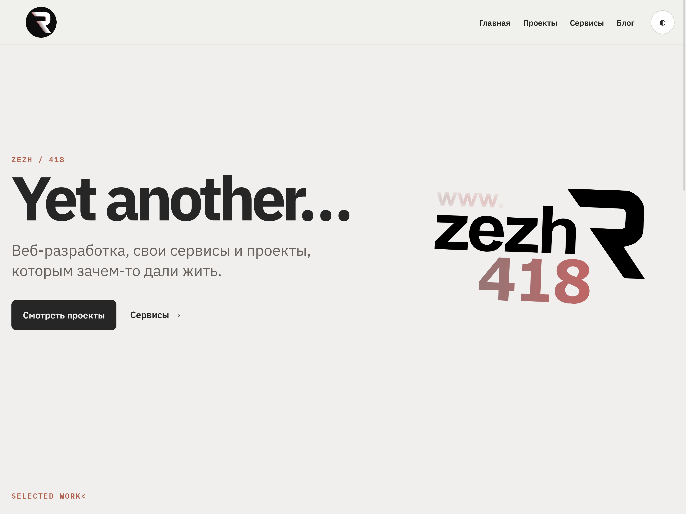

# ZEZH Portfolio



Да, это ещё одна тема для WordPress.

Нет, миру не была нужна ещё одна тема для WordPress.

Мне была нужна.

Сделана для личного сайта с портфолио, блогом и проектами. Без конструктора на 400 МБ, семнадцати вариантов header и кнопки «Купить Pro», которая преследует тебя по админке.

## Возможности

- Светлая и тёмная темы. Переключаются кнопкой, сохраняются в localStorage, уважают `prefers-color-scheme`.
- Два кастомных типа записей: **Проекты** и **Сервисы**. Проекты разложены по категориям: личные, учебные, заказные.
- Блог. Самый обычный.
- OpenGraph, Schema.org и `<meta description>` из коробки. SEO-плагинам здесь делать нечего, но если поставишь — тема отойдёт в сторону.
- Мобильное меню: кнопка-плюс, превращающаяся в крестик. Выглядит так, будто я долго это придумывал.
- Страница 404 с текстом «Ссылка либо умерла, либо никогда и не жила». Честно.
- Ни одной зависимости от сторонних CSS-фреймворков. Один файл `main.css`, ~3 КБ в сжатом виде.
- Ни одного вызова `wp_enqueue_script` для jquery.

## Чего нет

- Блочного редактора. Здесь всё на классическом редакторе и шаблонах PHP. Так и задумано.
- WooCommerce. Это не магазин.
- Enhanced Responsive Sticky Background Parallax Hero Section™. Нет, серьёзно, нет.

## Структура

```text
.
├── style.css                # Заголовок темы для WordPress
├── functions.php            # Вся логика: CPT, taxonomy, SEO, меню
├── index.php                # Фолбэк
├── front-page.php           # Главная: проекты по категориям + блог
├── home.php                 # Архив записей блога
├── single.php               # Одиночная запись
├── single-project.php       # Одиночный проект
├── single-service.php       # Одиночный сервис (с размытым фоном)
├── archive-project.php      # Архив проектов
├── archive-service.php      # Архив сервисов
├── page.php                 # Обычная страница
├── 404.php                  # Страница, которую никто не хочет видеть
├── header.php               # Шапка с меню и переключателем темы
├── footer.php               # Подвал
└── assets/
    ├── css/main.css         # Все стили в одном файле
    ├── js/main.js           # Переключатель темы и мобильное меню
    └── img/logo/            # Логотипы в светлом/тёмном варианте
```

## Установка

1. Скопируй папку темы в `wp-content/themes/zezh-portfolio/`.
2. Активируй в админке.
3. Создай меню «Основное меню» и «Меню в подвале» во Внешний вид → Меню.
4. Всё. Никаких «импортов демо-данных», «мастеров настройки» и прочего.

## Требования

- WordPress ≥ 6.4
- PHP ≥ 8.1
- Желание пользоваться темой, которая весит меньше, чем иные favicon

## Примечание

Эта тема не публикуется в директории WordPress.org. Она живёт здесь, делает ровно то, что нужно моему сайту, и не пытается понравиться всем. Если ты скачал её и используешь — ты либо я, либо тебе очень любопытно.